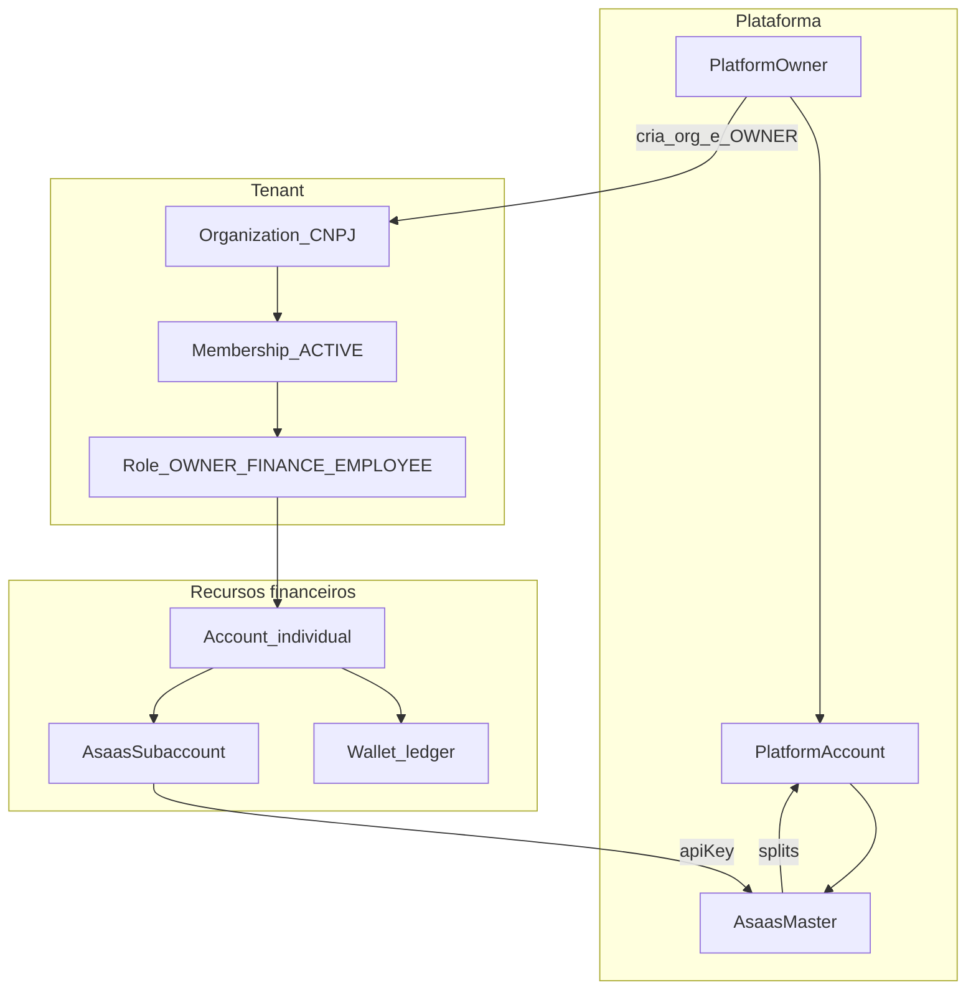
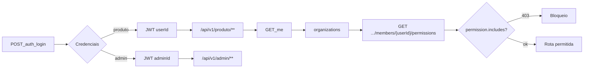
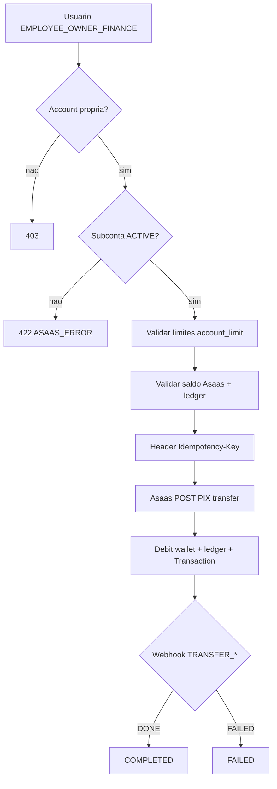
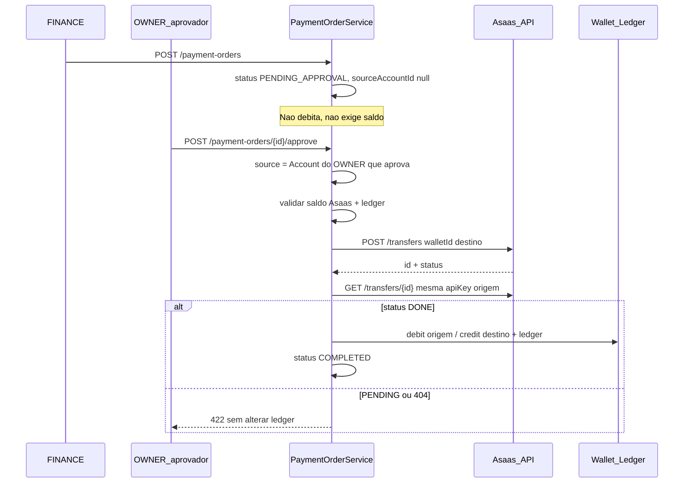
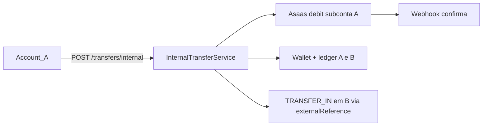
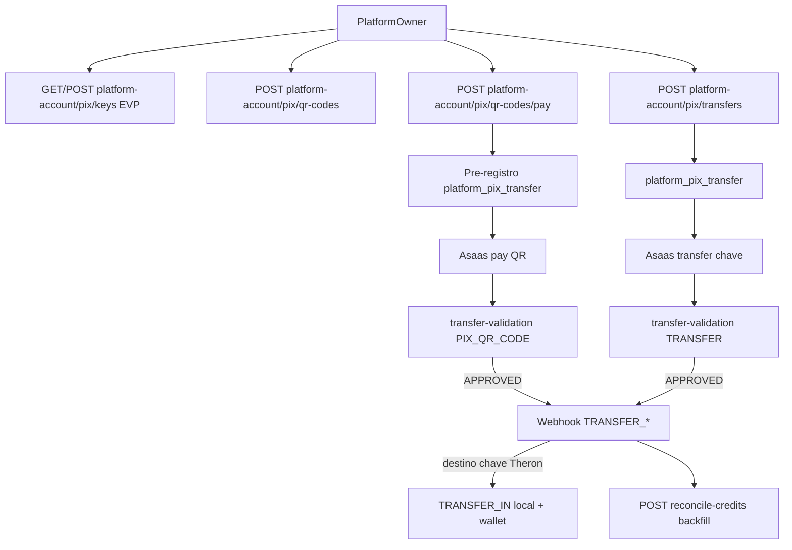
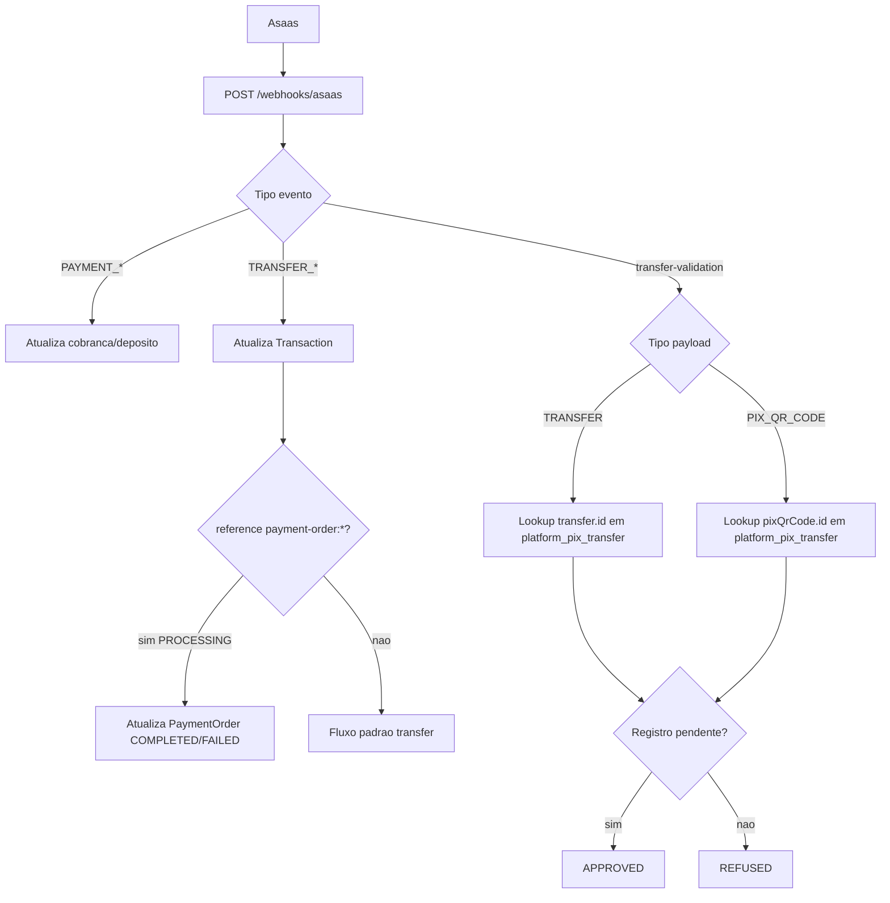
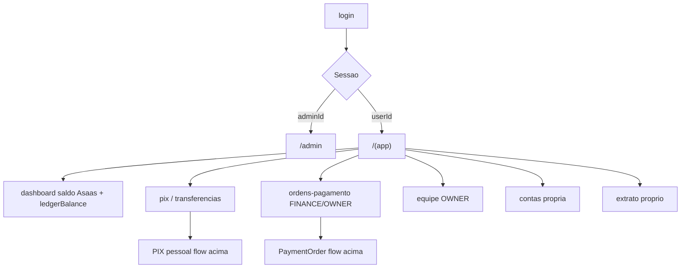
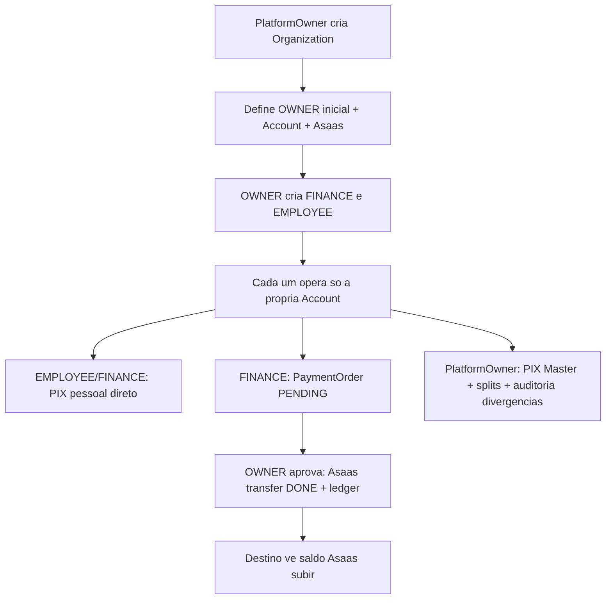

# Fluxograma do Sistema Theron Wallet (estado atual)

Fonte canônica de domínio: [`BUSINESS_RULES.md`](BUSINESS_RULES.md). Atualizado com controllers e implementação de Payment Order (provider-first Asaas).

---

## 1. Hierarquia e modelo de dados



**Regra central:** Organization **não tem saldo**. Dinheiro pertence à **Account individual** (1 user × 1 org × 1 Account × 1 Wallet × 1 Subconta Asaas).

---

## 2. Atores, autenticação e autorização



| Ator | Escopo | Frontend |
|------|--------|----------|
| Platform Owner | Admin plataforma, orgs, Master PIX, splits | `/admin` |
| OWNER | Org admin + própria Account + aprova PaymentOrder | `/dashboard`, `/equipe`, `/ordens-pagamento` |
| FINANCE | Própria Account + cria PaymentOrder | `/ordens-pagamento` |
| EMPLOYEE | Só operações pessoais (PIX, extrato) | `/pix`, `/transferencias` |

---

## 3. Provisionamento (onboarding)

```mermaid
sequenceDiagram
  participant Admin as PlatformOwner
  participant BE as Backend
  participant Asaas as Asaas_API
  participant Owner as OWNER_produto

  Admin->>BE: POST /admin/organizations
  Admin->>BE: POST /admin/organizations/{id}/owners
  BE->>BE: User + Membership OWNER + Account + Wallet
  BE->>Asaas: POST /accounts (subconta CNPJ org)
  Asaas-->>BE: apiKey + walletId

  Owner->>BE: POST /organization/members (FINANCE/EMPLOYEE)
  BE->>BE: User + Membership + Role + Account + Wallet
  BE->>Asaas: POST /accounts (CNPJ próprio MEI/filial)
  Asaas-->>BE: apiKey + walletId

  Note over Owner,BE: Bind idempotente; sandbox chama approve + sync status
```

**Saldo exibido na UI:** Asaas `GET /finance/balance` (fonte de verdade para o usuário). `wallet.balance` / `ledgerBalance` = espelho interno para auditoria.

---

## 4. PIX pessoal (sem aprovação)



- Chaves PIX criadas: só **EVP** (aleatória).
- Lookup destino: `GET /pix/keys/lookup` (modal de envio).
- **Sem** ApprovalPolicy para PIX pessoal.

---

## 5. Payment Order (folha / pagamento administrativo)



**Estados:** `PENDING_APPROVAL` → `COMPLETED` | `FAILED` | `REJECTED` | `CANCELLED`

**Legado:** ordens em `PROCESSING` → webhook `TRANSFER_*` ou `POST /admin/payment-orders/{id}/sync`

**Regras:**

- FINANCE cria/cancela; OWNER aprova/rejeita
- Criador **não** auto-aprova
- Saldo insuficiente no approve → **409**

---

## 6. Transferência interna (Theron → Theron)



Crédito local do destinatário vinculado via `externalReference = senderTx.id`.

---

## 7. Platform Account (Master Asaas)



---

## 8. Webhooks Asaas (sincronização)



---

## 9. Frontend (Next.js) — visão de navegação



Proxy Next.js: `/api/v1/*` → backend `:8080` (same-origin, sem CORS).

---

## 10. Fluxo-mãe (resumo executivo)



---

## Referências no código

| Fluxo | Arquivos principais |
|-------|---------------------|
| Payment Order | `PaymentOrderServiceImpl.java`, `PaymentOrderController.java` |
| PIX pessoal | `PixServiceImpl.java` |
| Webhooks | `WebhookServiceImpl.java`, `WebhookController.java` |
| Platform Master | `AdminPlatformController.java`, `PlatformPixServiceImpl.java` |
| Saldo / divergência | `AsaasBalanceServiceImpl.java`, `MeServiceImpl.java` |
| RBAC | `ResourceAuthorization.java`, seed Flyway V28 |
